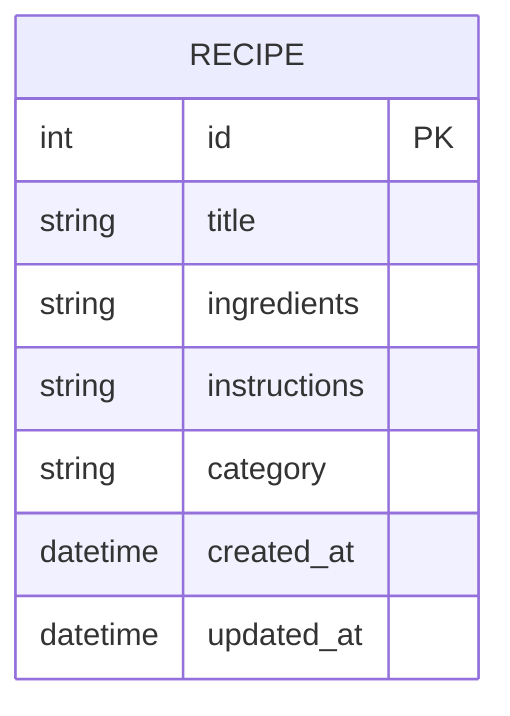

# 資料庫設計 (Database Design)

本文件為「食譜收藏夾」之資料庫設計，基於 PRD 中的 MVP 需求，定義 SQLite 資料庫內的資料表與關聯（Schema），並規範每個欄位的用途與資料型態。

## 1. ER 圖 (實體關係圖)

MVP 範圍主要專注在個人建立與管理食譜，且目前需求為「單一分類（如：中式、西式）」，因此我們將所有資訊集中在這張 `recipes` 表即可滿足球求，暫不需為了分類額外拆表。



## 2. 資料表詳細說明

### `recipes` 資料表

儲存使用者收藏的食譜。包含食譜的核心內容（標題、食材、步驟）、所屬的分類以及自動產生的建立/更新時間戳記。

| 欄位名稱 | 型別 | 必填 | PRIMARY KEY | FOREIGN KEY | 說明 |
| --- | --- | --- | --- | --- | --- |
| `id` | INTEGER | 是 | Yes (Autoincrement) | - | 唯一辨識碼 |
| `title` | TEXT | 是 | - | - | 食譜標題或名稱 |
| `ingredients` | TEXT | 是 | - | - | 食材清單與比例（使用文字儲存，可包含換行符號保留排版） |
| `instructions` | TEXT | 是 | - | - | 製作步驟指示（使用文字儲存，可包含換行符號） |
| `category` | TEXT | 是 | - | - | 單一分類標籤（例如：中式、西式、甜點、家常菜） |
| `created_at` | DATETIME | 是 | - | - | 該筆紀錄建立時間，預設為 `CURRENT_TIMESTAMP` |
| `updated_at` | DATETIME | 是 | - | - | 該筆紀錄最後更新時間，預設為 `CURRENT_TIMESTAMP` |

## 3. SQL 建表語法

請參考原始碼 `database/schema.sql` 中的對應配置：

```sql
CREATE TABLE IF NOT EXISTS recipes (
    id INTEGER PRIMARY KEY AUTOINCREMENT,
    title TEXT NOT NULL,
    ingredients TEXT NOT NULL,
    instructions TEXT NOT NULL,
    category TEXT NOT NULL,
    created_at DATETIME DEFAULT CURRENT_TIMESTAMP,
    updated_at DATETIME DEFAULT CURRENT_TIMESTAMP
);
```

## 4. Python Model 程式碼

系統採用純粹的 `sqlite3` 函式庫作為資料庫操作工具：
- `app/models/database.py`：負責取得 DB Connection 以及進行資料庫初始化。
- `app/models/recipe.py`：負責 `recipes` 資料表的完整 CRUD (Create, Read Update, Delete) 操作封裝。
