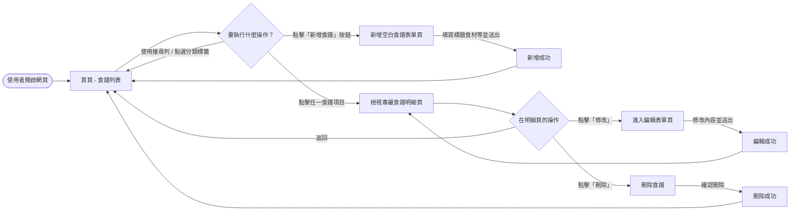
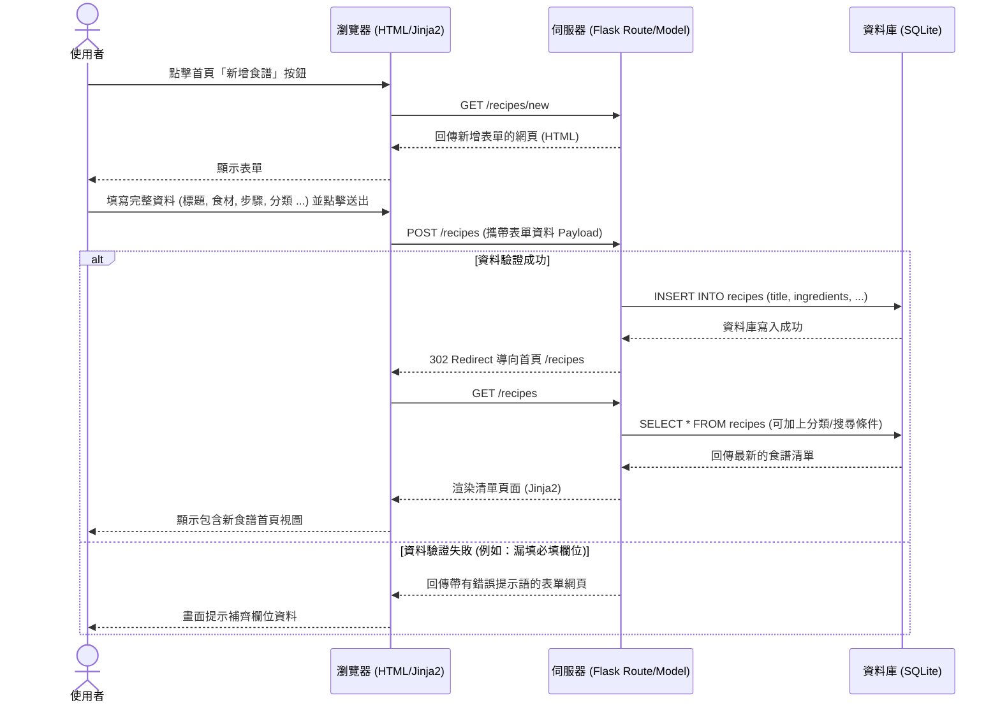

# 系統流程與使用者流程圖 (Flowcharts)

本文檔根據專案的需求規格 (PRD) 描述系統的「使用者流程圖」與「系統序列圖」。
> **備註**：由於目前尚未定義詳細的架構文件 (`docs/ARCHITECTURE.md`)，因此系統序列圖中的參與者（Flask, SQLite, HTML/Jinja2）是直接根據 PRD 中所規範的技術堆疊進行假設與設計。

## 1. 使用者流程圖 (User Flow)

描述使用者進入「食譜收藏夾」後，如何在一系列頁面與操作中完成新增、檢視、編輯與刪除等操作。

## 2. 系統序列圖 (Sequence Diagram)

以 MVP 核心功能「使用者新增食譜」為例，描述前端瀏覽器、後端 Flask Controller 以及 SQLite 資料庫之間的完整資料流與互動步驟。

## 3. 功能清單對照表

根據 PRD 定義的功能與上述流程，規劃出對應的後端操作、URL 路徑與 HTTP 方法：

| 功能區域 | 對應行為與說明 | URL 路徑 | HTTP 方法 |
| -------- | -------------- | -------- | --------- |
| **首頁與清單** | 顯示所有食譜的清單；也支援透過 Query String（諸如 `?q=關鍵字` 或 `?category=中式`）過濾資料。 | `/` 或 `/recipes` | `GET` |
| **新增食譜 (檢視)** | 從伺服器取得一張空白的新增表單。 | `/recipes/new` | `GET` |
| **新增食譜 (動作)** | 接收來自表單送交的新增請求，並將此份食譜儲存進資料庫，完成後返回列表。 | `/recipes` | `POST` |
| **檢視食譜明細** | 查看某一筆特定食譜 (`<id>`) 的詳細資訊，包含所有食材與實作步驟。 | `/recipes/<id>` | `GET` |
| **編輯食譜 (檢視)** | 取得一份含有該食譜 (`<id>`) 現有資料的表單，讓使用者進行修改。 | `/recipes/<id>/edit` | `GET` |
| **編輯食譜 (動作)** | 儲存針對特定食譜所做的變更，完成後刷新明細頁面。 | `/recipes/<id>` | `POST` (或用 `PUT`) |
| **刪除食譜** | 從資料庫裡將特定的食譜資料完全移除。 | `/recipes/<id>/delete` | `POST` (或用 `DELETE`) |
